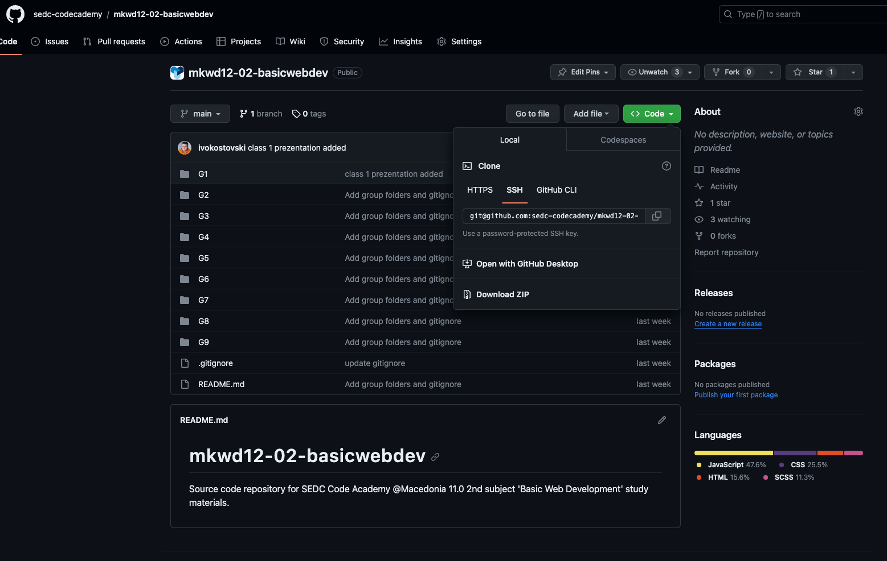
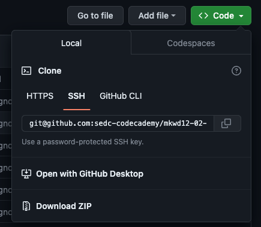

# How to

## How to install Visual Studio Code

1. Go this [link](https://code.visualstudio.com/Download)
2. Pick the right version for your OS

3. Download it
4. Click on the downloaded file to start the installation
5. Follow the instructions (click next on all the steps, EXCEPT the one where you can choose to create a "Open with Code" shortcut)
6. When you are at the step where you can choose to create a "Open with Code" shortcut, check both boxes, and also check the box "Create a desktop shortcut"
7. Click next and finish the installation
8. Open Visual Studio Code

## How to open a folder in Visual Studio Code
There are several ways to open a folder in Visual Studio Code. Here are three of them:
1. Create a folder on your computer, and drag it over to Visual Studio Code icon. This will open the folder in Visual Studio Code
2. Open Visual Studio Code, and click on "File" in the top left corner. Then click on "Open Folder". Then select the folder you want to open, and click "Open"
3. Create a folder on your computer. Then right click on the folder, and click on "Open with Code"

## How to install GitHub Desktop
1. Go to this [link](https://desktop.github.com/)
2. Click on the "Download for Windows (or your OS)" button
3. Click on the downloaded file to start the installation
4. Login with your GitHub account (register a new account if you don't have one)
5. Click next on all the steps to finish the installation
6. Open GitHub Desktop

## How to clone a repository
There are several ways of cloning a repository. Here are two of them:

I. By using GitHub Desktop
1. Go to the repository you want to clone
2. Click on the green "Code" button
3. Click on "Open with GitHub Desktop"

4. Choose where you want to save the repository on your computer
5. Click on "Clone"

Video example: 

https://github.com/sedc-codecademy/mkwd12-02-basicwebdev/assets/148893109/c69161c3-446a-402b-8aaa-bd6592587453

II. Download the repository as a zip file
1. Go to the repository you want to clone
2. Click on the green "Code" button
3. Click on "Download ZIP"

4. Choose where you want to save the repository on your computer
5. Click on "Save"
6. Go to the folder where you saved the repository
7. Right-click on the zip file, and click on "Extract All"
8. Choose where you want to extract the files
9. Click on "Extract"
10. Go to the folder where you extracted the files to see the files you've downloaded

## How to create a GitHub repository
1. Go to GitHub
2. Click on the "+" button in the top right corner
3. Click on "New repository"
4. Choose a name for your repository (ex. HTML_CSS_homework)
5. Choose if you want the repository to be public
6. Check the box "Initialize this repository with a README"
7. Click on "Create repository"
8. Now you have created a repository

Now you can clone this repository locally, and start working on it. Create folders and files on your local computer, and then push them to GitHub.

## How to push changes to GitHub
1. Open GitHub Desktop
2. Make sure you have selected your repository in the top left corner
3. Write a summary of the changes you've made in the "Summary" box
4. Click on "Commit to main"
5. Click on "Push origin"
6. Now you have pushed your changes to GitHub
7. Go to your repository on GitHub to see the changes

